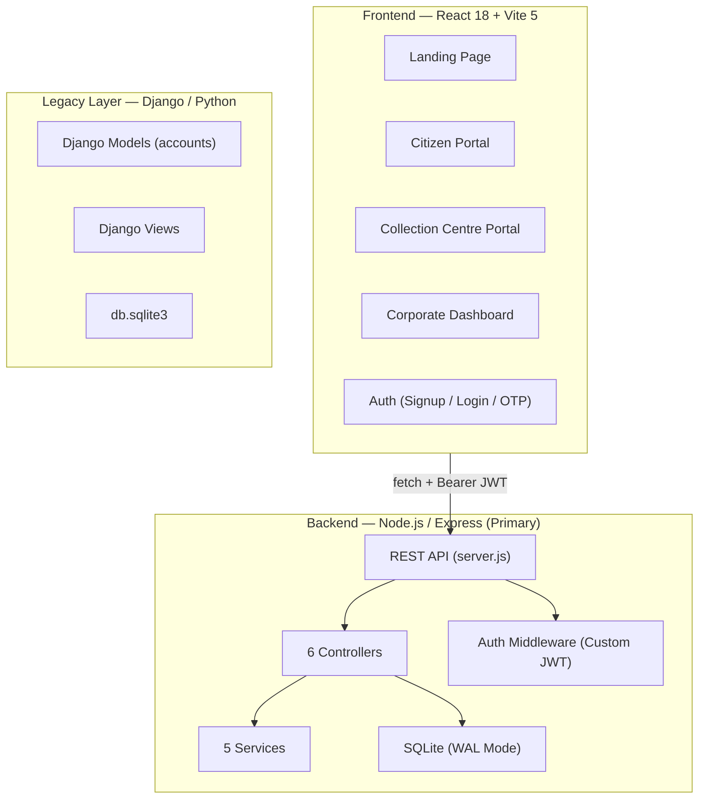

# EcoHub — Complete Project Analysis & Summary

> **Date:** 5 October 2026  
> **Scope:** Pure reflection of everything built — no assumptions, no code changes.

---

## 1. What Is EcoHub?

EcoHub is a **national-scale, evidence-based e-waste disposal and circular-economy platform** built for India. It connects four stakeholder roles — **Citizens, Collection Centres, Companies (Brands), and a Central Admin** — into a single, verified lifecycle for electronic waste.

The core value proposition: a citizen disposes of an e-waste item, gets it physically verified at a collection centre, completes a sustainability challenge (planting/watering a seed from an EcoBag), earns **EcoCredits** and brand coupons, while the originating company gets auditable CSR compliance reports — all tracked with QR codes, cryptographic hashes, and an AI-verification pipeline.

---

## 2. Architecture Overview



| Layer | Stack | Status |
|-------|-------|--------|
| **Frontend** | React 18, Vite 5, React Router v6, `html5-qrcode`, `qrcode.react`, `jspdf` | ✅ Active, primary UI |
| **Backend (Primary)** | Node.js, Express, `node:sqlite` (DatabaseSync), custom JWT, Nodemailer | ✅ Active, fully functional |
| **Backend (Legacy)** | Django 4+, Python, DRF, separate `db.sqlite3` | ⚠️ Present but **not actively wired** to the React frontend |
| **Database** | SQLite with WAL mode + foreign keys (`ecohub.sqlite` — 27 MB) | ✅ Active |

---

## 3. Database Schema (Node.js / SQLite)

**18 tables** are created and managed via [db.js](file:///c:/Users/Dell/Downloads/Ecohub1R/Ecohub1R/server/db.js):

| Table | Purpose |
|-------|---------|
| `users` | All user accounts (citizens, admin, company logins) |
| `user_profiles` | Extended profile: phone, city, sustainability level, badges |
| `companies` | Approved company records (name, brand_code, CSR budget) |
| `company_applications` | Pending company registration applications |
| `collection_centres` | Active, approved collection centres |
| `collection_centre_applications` | Pending centre registration applications |
| `disposals` | Core table — every e-waste submission with 30+ columns including trust scores, hashes, GPS, evidence |
| `challenges` | Plant-watering video challenge submissions with AI scores |
| `wallets` | Per-user EcoCredits balance |
| `wallet_transactions` | Debit/credit ledger for EcoCredits |
| `coupons` | Brand discount coupons unlocked by users |
| `ecobag_orders` | Company orders for branded EcoBags |
| `ecobags` | Individual EcoBag records with QR and status |
| `notifications` | In-app notification system |
| `email_logs` | Full audit log of every email sent/attempted |
| `impact_reports` | Generated corporate CSR impact reports |
| `otps` | OTP codes for phone/email verification |
| `trust_scores` | Detailed trust score breakdown per disposal |
| `verification_logs` | Immutable, hash-chained audit trail of verification events |
| `system_settings` | Key-value config (e.g., seeding baseline flag) |

---

## 4. API Surface (66+ Endpoints)

Defined in [server.js](file:///c:/Users/Dell/Downloads/Ecohub1R/Ecohub1R/server/server.js) — organized into 7 domains:

### 4.1 Authentication & OTP (8 endpoints)
- User registration, login, profile retrieval
- OTP send/verify flow
- Email verification token links
- Dual registration path: standard and OTP-based

### 4.2 Disposals & E-Waste Submissions (6 endpoints)
- Authenticated disposal submission (`POST /api/disposals`)
- Public/anonymous disposal submission (`POST /api/disposals/public`)
- User's disposal history, individual disposal lookup
- Disposal journey tracker (4-stage lifecycle)
- EcoBag info lookup by bag ID

### 4.3 Collection Centres (8 endpoints)
- Centre listing with GPS proximity sorting (Haversine distance)
- Centre self-registration and login
- QR-based disposal verification (centre scans citizen's QR)
- Centre dashboard with stats
- Admin one-click email approval/rejection via token links

### 4.4 EcoCredits & Challenges (5 endpoints)
- Get user's plants (seed-linked disposals)
- Video challenge prompt generation (random from pool of 3 challenges)
- Challenge submission with AI video verification
- Wallet balance + transaction history
- Gamification stats (rank, badges, leaderboard)

### 4.5 Company Portal (8 endpoints)
- Company application submission
- Token-based admin approval/rejection via email links
- Company metrics dashboard (strict brand-code tenant isolation)
- Impact report generation (CSR compliance, SDG alignment)
- EcoBag ordering + inventory lookup

### 4.6 Admin Portal (14 endpoints)
- Global overview dashboard (all aggregate metrics)
- Company & Centre application management
- AI review queue for video challenges
- Challenge status override (reject only — approve is AI-only)
- EcoBag order management + QR batch printing data
- Full audit ledger, email logs, user/disposal listings
- Verification exception queue

### 4.7 Notifications (2 endpoints)
- Fetch user notifications (last 20)
- Mark notification as read

---

## 5. Backend Services (5 Service Modules)

| Service | File | What It Does |
|---------|------|--------------|
| **Email Service** | [emailService.js](file:///c:/Users/Dell/Downloads/Ecohub1R/Ecohub1R/server/services/emailService.js) (633 lines) | Comprehensive email automation: disposal confirmation certificates, item-received receipts, AI verification results, company approvals, centre approvals, order notifications. Each email is a fully designed HTML template. Also handles in-app notification creation. Supports real SMTP via Nodemailer or log-only mode. |
| **Trust Score Engine** | [trustScoreEngine.js](file:///c:/Users/Dell/Downloads/Ecohub1R/Ecohub1R/server/services/trustScoreEngine.js) | 5-factor scoring (0–100): Photo Similarity via perceptual hash (35pts), GPS Proximity (20pts), Timestamp Validity (15pts), Device Category Match (15pts), Cryptographic Hash Integrity (15pts). Includes Hamming distance calculation and luminance-block fingerprinting. |
| **Video Verification** | [videoVerificationService.js](file:///c:/Users/Dell/Downloads/Ecohub1R/Ecohub1R/server/services/videoVerificationService.js) | Validates plant-watering video challenges. Duplicate video detection via SHA-256 hash. Delegates to an external AI verifier API (configurable) checking: eco bag visible, person performs challenge, continuous live action, replay detection, manipulation detection. Graceful fallback when AI is unavailable. |
| **Product Image Verification** | [productImageVerificationService.js](file:///c:/Users/Dell/Downloads/Ecohub1R/Ecohub1R/server/services/productImageVerificationService.js) | Multi-image e-waste verification: first capture, second capture, product ID image. Calls external AI API checking 11 properties (e-waste detected, same physical object, brand/model/serial match, liveness, GPS consistency, anti-screenshot, anti-manipulation). Weighted confidence scoring across 6 dimensions. |
| **Report Service** | [reportService.js](file:///c:/Users/Dell/Downloads/Ecohub1R/Ecohub1R/server/services/reportService.js) | Generates comprehensive corporate impact reports: total e-waste managed, verified disposals, environmental impact (CO₂, toxic metals, landfill space, energy), tree/plant metrics, user participation, carbon reduction estimates, sustainability scoring (AAA Platinum / AA Gold / A Standard), CSR contribution, SDG 12/13/15 alignment. |

---

## 6. Security & Verification Architecture

| Mechanism | Implementation |
|-----------|----------------|
| **Authentication** | Custom HMAC-SHA256 JWT (no `jsonwebtoken` library — hand-rolled in [auth.js](file:///c:/Users/Dell/Downloads/Ecohub1R/Ecohub1R/server/middleware/auth.js)) with 7-day expiry |
| **Password Hashing** | SHA-256 (via `crypto.createHash`) |
| **Role-Based Access Control** | `requireRole()` middleware — roles: `user`, `company`, `collection_centre`, `admin` |
| **Company Tenant Isolation** | `enforceCompanyPrivacy()` middleware forces brand_code scoping on all company queries |
| **Disposal Integrity** | Registration hashes, photo hashes (user + centre), cryptographic hash chain in `verification_logs` |
| **Trust Scoring** | Multi-factor 0–100 trust score with full diagnostics persisted to `trust_scores` table |
| **Anti-Fraud (Video)** | Duplicate video detection, external AI for replay/manipulation detection, challenge tokens with 15-minute expiry |
| **Anti-Fraud (Images)** | Liveness detection, screenshot detection, multi-capture consistency, GPS consistency |
| **OTP Verification** | Time-bound OTP codes stored in `otps` table |
| **Email Verification Tokens** | Cryptographic tokens for one-click approvals/rejections |

---

## 7. Frontend Architecture

### 7.1 Routing Structure (via React Router v6)

```
/                          → LandingPage (dark-themed hero)
/signup                    → Citizen Signup (OTP-based)
/login                     → Citizen Login
/verify/:token             → Email Verification

/citizen/                  → CitizenLayout
  ├── dispose              → CitizenDisposalFlow (1095 lines — the largest page)
  ├── claim                → ClaimAward
  ├── challenge            → CitizenVideoChallenge
  └── wallet               → EcoCreditsWallet

/centre/login              → CollectionPointLogin
/centre/register           → CollectionPointRegister
/centre/dashboard          → CollectionCentrePortal (51K — second largest)

/corporate/login           → CorporateLoginPage
/corporate/register        → CompanyRegister (23K)
/corporate/dashboard       → CompanyDashboard

/privacy                   → PrivacyPolicyPage
/terms                     → TermsPage
```

Legacy redirects are in place for old URLs (`/dispose`, `/company-login`, etc.).

### 7.2 Key Frontend Components

| Component | File | Purpose |
|-----------|------|---------|
| `LiveCameraCapture` | [LiveCameraCapture.jsx](file:///c:/Users/Dell/Downloads/Ecohub1R/Ecohub1R/frontend/src/components/LiveCameraCapture.jsx) | Dual-mode capture: live webcam (getUserMedia) + file upload fallback. Generates device IDs, GPS metadata, timestamps. |
| `WasteJourneyExplorer` | [WasteJourneyExplorer.jsx](file:///c:/Users/Dell/Downloads/Ecohub1R/Ecohub1R/frontend/src/components/WasteJourneyExplorer.jsx) | 4-stage visual disposal lifecycle tracker |
| `Navbar` | [Navbar.jsx](file:///c:/Users/Dell/Downloads/Ecohub1R/Ecohub1R/frontend/src/components/Navbar.jsx) | Multi-portal navigation with role awareness |
| `NearbyCentersMap` | [NearbyCentersMap.jsx](file:///c:/Users/Dell/Downloads/Ecohub1R/Ecohub1R/frontend/src/NearbyCentersMap.jsx) | GPS-based collection centre finder |

### 7.3 Layouts

Three role-specific layouts wrap their portal pages:
- `CitizenLayout` — sidebar with Dispose / Claim / Challenge / Wallet
- `CentreLayout` — collection centre navigation
- `CorporateLayout` — company dashboard navigation

### 7.4 API Layer

[api.js](file:///c:/Users/Dell/Downloads/Ecohub1R/Ecohub1R/frontend/src/api.js) provides:
- Token management (localStorage + sessionStorage, multi-key compatibility)
- Current user getter/setter
- Universal `apiRequest()` wrapper with dual calling conventions (positional + options object)

---

## 8. The Core User Journey (Built End-to-End)

```mermaid
flowchart LR
    A["1. Citizen registers\n& logs in"] --> B["2. Submits e-waste\ndisposal request\n(photos + GPS + QR)"]
    B --> C["3. Visits Collection\nCentre with item"]
    C --> D["4. Centre scans QR\n& verifies item\n(AI image verification)"]
    D --> E["5. Trust Score\ncalculated (0-100)"]
    E --> F["6. Video Challenge:\nPlant the seed\nfrom the EcoBag"]
    F --> G["7. AI verifies\nvideo submission"]
    G --> H["8. EcoCredits\nawarded to wallet"]
    H --> I["9. Brand coupons\nunlocked"]
    I --> J["10. Company gets\nCSR Impact Report"]
```



**Emails are sent at multiple stages:**
1. Disposal confirmation (certificate-style with embedded QR)
2. Item received at collection centre
3. AI verification results
4. Company/Centre approval notifications

---

## 9. The Django Legacy Layer

The `accounts/` Django app and `config/` project exist in the workspace with:
- **Models:** CollectionCenter, CompanyRegistration, Company, Package, OrderPackage, Profile, PackageQR, Disposal, EcoBag, EcoBagOrder
- **Views:** Order bags, reset password, verify company, company registration, centre registration, QR scanning, disposal flows
- A separate `db.sqlite3` (253 KB) database

> [!IMPORTANT]
> The Django backend appears to be the **original/v1 implementation** that has been superseded by the Node.js/Express backend. The React frontend (`frontend/`) talks exclusively to the Express server. The Django code is **not wired** to the current frontend and exists as legacy code in the repository. The Django models are duplicated (each model class appears twice in `models.py`), further suggesting it's unmaintained legacy.

---

## 10. Codebase Statistics

| Metric | Count |
|--------|-------|
| **Frontend pages** | 18 JSX files in `pages/` |
| **Frontend components** | 3 reusable components + 3 layouts |
| **CSS files** | 9 stylesheets (~170 KB total) |
| **Backend controllers** | 6 controller files (~136 KB total) |
| **Backend services** | 5 service files (~70 KB total) |
| **Database tables** | 18+ tables |
| **API endpoints** | 66+ routes |
| **Total frontend src** | ~22 files, ~300 KB of JSX/JS |
| **Total backend** | ~15 files, ~210 KB of JS |
| **SQLite database** | 27 MB (live data present) |
| **Largest single file** | `CitizenDisposalFlow.jsx` (1,095 lines / 49 KB) |
| **Second largest** | `CollectionCentrePortal.jsx` (51 KB) |

---

## 11. What's Complete & Functional

| Feature | Status |
|---------|--------|
| Multi-role authentication (citizen, company, centre, admin) | ✅ Built |
| OTP-based registration | ✅ Built |
| E-waste disposal submission with multi-image evidence | ✅ Built |
| Live camera capture with GPS + device metadata | ✅ Built |
| QR code generation for disposals and EcoBags | ✅ Built |
| Collection centre registration + admin approval flow | ✅ Built |
| QR-based disposal verification at centres | ✅ Built |
| Multi-factor Trust Score (0-100) | ✅ Built |
| Product image AI verification pipeline (external API) | ✅ Built (infra-dependent) |
| Video challenge system (plant watering) | ✅ Built |
| Video AI verification pipeline (external API) | ✅ Built (infra-dependent) |
| EcoCredits wallet with transaction ledger | ✅ Built |
| Brand coupon unlocking | ✅ Built |
| Gamification (ranks, badges, leaderboard) | ✅ Built |
| Company registration + admin email approval | ✅ Built |
| Company dashboard with strict tenant isolation | ✅ Built |
| EcoBag ordering by companies | ✅ Built |
| Corporate Impact Reports (CSR + SDG alignment) | ✅ Built |
| Admin overview dashboard | ✅ Built |
| Admin: company/centre application management | ✅ Built |
| Admin: AI review queue + manual override | ✅ Built |
| Admin: EcoBag order management | ✅ Built |
| Admin: Audit ledger + email logs | ✅ Built |
| Admin: Verification exceptions | ✅ Built |
| Automated email system (6+ templates, SMTP + log mode) | ✅ Built |
| In-app notifications | ✅ Built |
| Waste Journey Explorer (4-stage lifecycle view) | ✅ Built |
| Nearby centres with GPS + Haversine distance | ✅ Built |
| Legal pages (Privacy Policy, Terms) | ✅ Built |
| Hash-chained verification audit logs | ✅ Built |
| Anti-fraud: duplicate video detection | ✅ Built |
| Production static serving (Vite dist) | ✅ Built |

---

## 12. External Dependencies / Infrastructure Requirements

| Dependency | Required For | Current State |
|------------|-------------|---------------|
| SMTP credentials (`SMTP_HOST`, `SMTP_USER`, `SMTP_PASS`) | Real email delivery | Optional — falls back to log-only |
| `VIDEO_VERIFIER_URL` + token | AI video verification | Optional — gracefully degrades |
| `PRODUCT_IMAGE_VERIFIER_URL` + token | AI product image verification | Optional — gracefully degrades |
| `JWT_SECRET` env var | Token signing | Has hardcoded fallback |

---

## 13. Notable Design Decisions

1. **Zero external dependency for JWT** — Hand-rolled HMAC-SHA256 JWT implementation instead of using `jsonwebtoken`.
2. **SQLite over PostgreSQL/MySQL** — Entire platform runs on a single SQLite file with WAL mode for concurrent reads.
3. **Schema migration via try/catch ALTER TABLE** — No formal migration tool; columns are added with individual `ALTER TABLE` wrapped in try-catch blocks.
4. **AI verification is pluggable** — Both video and image verification call external APIs but gracefully return "Unavailable" when not configured, allowing the platform to function without AI infrastructure.
5. **No seeded fake data** — The `clearSeededDataOnce()` function explicitly wipes demo data, leaving only the admin account. All data must come from real registration flows.
6. **Emails as audit trail** — Every email (sent or logged-only) is stored in `email_logs` with full HTML body, creating a complete communication audit.
7. **Company tenant isolation is middleware-enforced** — `enforceCompanyPrivacy()` prevents any company from seeing another's data at the middleware level, not just query level.
